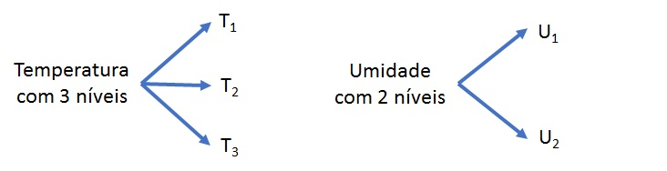

```{r, include = FALSE}
knitr::opts_chunk$set(
  collapse = TRUE,
  comment = "#>"
)
```

```{css, echo = FALSE}
body {
     text-align: justify;
}

```

# Fundamentos 

|     Análise de dois ou mais fatores de tratamento em um mesmo experimento, logo os tratamentos serão as combinações dos níveis dos fatores. 

__Exemplo 1__: Avaliação do efeito da adubação NPK sobre uma determinada cultura
	
$$\left.\begin{array}{l}
	\mbox{N com 2 níveis}\\ \nonumber
	\mbox{P com 2 níveis}\\ \nonumber
	\mbox{K com 2 níveis} \nonumber
	\end{array} 
	\right\} = 2\times 2 \times 2 = 2^3 = \mbox{8 tratamentos}$$
	
	
Lê-se: fatorial dois por dois por dois ou fatorial dois ao cubo.


Tratamentos:


* $N_0P_0K_0$ 
* $N_0P_0K_1$ 
* $N_0P_1K_0$ 
* $N_0P_1K_1$ 
* $N_1P_0K_0$ 
* $N_1P_0K_1$ 
* $N_1P_1K_0$ 
* $N_1P_1K_1$ 


__Exemplo 2__: Avaliação da Temperatura e da Umidade sobre o tempo de consevação de um produto.




$$3 \times 2 = \mbox{6 tratamentos}$$

Lê-se: fatorial três por dois.
	
Temperatura| $U_1$| $U_2$|
-----------|------|------|
$T_1$ | $T_1U_1$ | $T_1U_2$| 
$T_2$ | $T_2U_1$ | $T_2U_2$|
$T_3$ | $T_3U_1$ | $T_3U_2$| 


## Planejamento e croqui

|      As combinações dos níveis dos fatores serão casualizadas às parcelas, de acordo com o delineamento experimental selecionado.
O planejamento pode seguir qualquer um dos delineamentos vistos anteriormente:

```{r , echo = FALSE , warning = FALSE}
library(gridExtra)
library(agricolae)
library(agricolaeplotr)

Tratamentos <- c("Manhã:1", "Manhã:3",
                 "Meio dia:1", "Meio dia:3",
                 "Tarde:1", "Tarde:3")

Plano.DIC <- design.crd(Tratamentos,
                        r = 4)

grafico1 <- plot_design_crd(Plano.DIC,
                            factor_name = "Tratamentos",
                            labels = "Tratamentos",
                            ncols = 6,
                            nrows = 4)

Plano.DBC <- design.rcbd(Tratamentos,
                         r = 4)

grafico2 <- plot_rcdb(Plano.DBC,
                      factor_name = "Tratamentos",
                      labels = "Tratamentos")

Plano.DQL <- design.lsd(Tratamentos)

grafico3 <- plot_latin_square(Plano.DQL,
                              factor_name = "Tratamentos",
                              labels = "Tratamentos")


grid.arrange(
          grafico1,
          grafico2,
          grafico3,
          ncol = 1,
          nrow = 3)
```


## Vantagens e Desvantagens dos esquemas fatoriais de tratamentos
		
__Vantagens__ : Permitem estudar os efeitos simples e principais dos fatores, bem como o efeito da interação envolvendo os mesmos.

__Desvantagens__ : O número de tratamentos pode ser elevado devido ao número de fatores e/ou ao número de níveis dos fatores.

Exemplos:

* $2\times 2 = 2^2 \Rightarrow$ 4 tratamentos
* $3\times 3 = 3^2 \Rightarrow$ 9 tratamentos
* $5\times 4 \Rightarrow$ 20 tratamentos
* $4\times 3 \times 3 \Rightarrow$ 36 tratamentos


# Análise dos dados

## Modelo estatístico

|      O modelo estatístico, considerando-se um experimento seguindo o delineamento inteiramente casualizado com $r$ repetições, dois fatores de tratamento, $A$ com $a$ níveis e $B$ com $b$, é dado por:

$$y_{ikj} = \mu + \alpha_i + \gamma_k + (\alpha\gamma)_{ik} + e_{ikj},$$

em que: 

* $y_{ikj}$ é o valor observado no $i$-ésimo nível do fator $A$ e $k$-ésimo nível do fator $B$ na $j$-ésima repetição; 

* $\mu$ é uma constante, comum a todas as observações; 

* $\alpha_i$ é o efeito do $i-$ésimo nível do fator $A$; 

* $\gamma_k$ é o efeito do $k-$ésimo nível do fator $B$;

* $(\alpha\gamma)_{ik}$ é o efeito da interação entre  entre o $i-$ésimo nível do fator $A$ e o $k-$ésimo nível do fator $B$

* $e_{ikj}$ é o efeito do acaso.


### Estimadores dos parâmetros pelo método dos mínimos quadrados}

Dado o modelo

$$y_{ikj} = \mu + \alpha_i + \gamma_k + (\alpha\gamma)_{ik} + e_{ikj},$$

as restrições usuais são:

$$\sum_{i=1}^{a}\hat{\alpha}_i = 0$$
$$\sum_{k=1}^{b}\hat{\gamma}_k = 0$$
$$\sum_{i=1}^{a}\hat{(\alpha\gamma)}_{ik} = \sum_{k=1}^{b}\hat{(\alpha\gamma)}_{ik} = \sum_{i=1}^{a}\sum_{k=1}^{b}\hat{(\alpha\gamma)}_{ik} = 0$$

As soluções de mínimos quadrados, considerando-se as restrições, são:

$$\hat{\mu} = \bar{Y},$$
$$\hat{\alpha}_i = \bar{Y}_i - \bar{Y},$$
$$\hat{\gamma}_k = \bar{Y}_k - \bar{Y} \text{ e }$$
$$\hat{(\alpha\gamma)}_{ik} = \bar{Y}_{ik} - \bar{Y}_i - \bar{Y}_k + \bar{Y}.$$


## Quadro da ANOVA

|     Para um experimento seguindo o delineamento inteiramente casualizado com $r$ repetições, dois fatores de tratamento, $A$ com $a$ níveis e $B$ com $b$, o esquema da tabela ANOVA que considera apenas os $ab$ Tratamentos é dado por:


Fontes de variação | graus de liberdade |
-|-|
Tratamentos | $ab-1$|
Resíduo | $ab(r-1)$|
Total |$abr - 1$|
	


|     Para um experimento seguindo o delineamento inteiramente casualizado com $r$ repetições, dois fatores de tratamento, $A$ com $a$ níveis e $B$ com $b$, o esquema da tabela ANOVA que considera a decomposição do número de graus de liberdade de Tratamentos para avaliar efeitos principais e de interação é dado por:


Fontes de variação | graus de liberdade| \\ \hline
-|-|
Fator $A$ | $a-1$ |
Fator $B$ | $b-1$ |
Interação $A\# B$ | $(a-1)(b-1)$ |
(Tratamentos) | $(ab-1)$  |
Resíduo | $ab(r-1)$|
Total | $abr - 1$ |
	


Hipóteses:

$$H_0: \text{Não há efeito da interação}$$ 
$$H_1: \text{Há efeito da interação.}$$

Observações:

|   Quando o efeito da interação for não significativo, ou seja, os fatores podem ser considerados independentes, deve-se observar a significância dos efeitos principais.
|	   Quando o efeito da interação for significativo não se devem olhar os efeitos principais, mas sim os efeitos simples, ou seja, avaliar o efeito do fator A dentro de cada nível do fator B e/ou o efeito do fator B dentro de cada nível do fator A.


Hipóteses:

$$H_0: \mu_{A_1} = \mu_{A_2} = \ldots= \mu_{A_a} = \mu$$ 
$$H_1: \text{Pelo menos duas médias diferem entre si.}$$


$$H_0: \mu_{B_1} = \mu_{B_2} = \ldots= \mu_{B_b} = \mu$$ 
$$H_1: \text{Pelo menos duas médias diferem entre si.}$$


Efeito de $B$ dentro de cada nível de $A$ ($A + B[A]$)
	
Efeito de $A$ dentro de cada nível de $B$ ($B + A[B]$)


# Exemplo - Fatorial 2X2

|      Os dados da Tabela 1 foram obtidos em um experimento fatorial $2\times2$ segundo o delineamento inteiramente casualizado com três repetições, para analisar o efeito da calagem e da irrigação sobre o peso de plantas.

Tabela1: Peso de plantas cultivadas segundo o tratamento

x| $I_0C_0$ |	$I_0C_1$|	$I_1C_0$|$I_1C_1$ |
-|-|-|-|-|		
- |25 |	35 |	41 |	60 |
- | 32 |	28 |	35 |	67|
-| 27 |  33 |	38 |	59 |
Totais |84 | 96 | 114 | 186|
		


Quadro auxiliar de totais dos níveis dos fatores

-|$C_0$ | $C_1$ | Totais|
-|-|-|-|
$I_0$|  84$^{(3)}$ | 96$^{(3)}$ | 180$^{(6)}$  |
$I_1$ | 114$^{(3)}$ | 186$^{(3)}$ | 300$^{(6)}$  |
Totais | 198$^{(6)}$ | 282$^{(6)}$ | 480$^{(12)}$  |


Fonte: Vieira, Sônia (2006)

Quadro auxiliar de médias dos níveis dos fatores


-|$C_0$|$C_1$ | Médias |     
-|-|-|-|
$I_0$| 28|32| 30|   
$I_1$| 38|62| 50|  
Médias| 33|47| 40|  

Fonte: Vieira, Sônia (2006)


Soma de quadrados do Total

$$\displaystyle{SQ_{\text{Total}} = \sum_i\sum_k\sum_j y_{ikj}^2 - \frac{(\sum_i\sum_k\sum_j y_{ikj})^2}{abr}}$$


$$SQ_{\text{Total}} = 25^2 + 32^2 + 27^2 + \ldots + 59^2 - \frac{480^2}{12} = 2196$$


Soma de quadrados de Irrigação

$$\displaystyle{SQ_{\text{Irrigação}} = \frac{1}{br} \sum_i y_{i\cdot\cdot}^2 - \frac{y_{\cdot\cdot\cdot}^2}{abr}}$$


$$SQ_{\text{Irrigação}} = \frac{1}{6}({180}^2 + {300}^2) - \frac{{480}^2}{12} = 1200$$


Soma de quadrados de Calagem

$$\displaystyle{SQ_{\text{Calagem}} = \frac{1}{ar} \sum_k y_{\cdot k\cdot}^2 - \frac{y_{\cdot\cdot\cdot}^2}{abr}}$$


$$SQ_{\text{Calagem}} = \frac{1}{6}({198}^2 + {282}^2) - \frac{{480}^2}{12} = 588$$


 
Soma de quadrados da combinação Irrigação,Calagem (Tratamentos)

$$\displaystyle{SQ_{\text{I,C}} = \frac{1}{r} \sum_i\sum_k y_{ik\cdot}^2 - \frac{y_{\cdot\cdot\cdot}^2}{abr}}$$


$$SQ_{\text{I,C}} = \frac{1}{3}({84}^2 + {96}^2 + {114}^2 + {186}^2) - \frac{{480}^2}{12} = 2088$$


Soma de quadrados da Interação Irrigação$\#$Calagem

$$\displaystyle{SQ_{\text{I\# C}} = SQ_{\text{I,C}} - SQ_{\text{I}} - SQ_{\text{C}}}$$


$$SQ_{\text{I\#C}} = 2088 - 1200 - 588 = 300$$


Hipóteses

$$H_0: \text{Não há efeito da interação} $$
$$H_1: \text{Há efeito da interação}$$

Quadro da ANOVA

Fontes de variação | gl | SQ | QM | Fcal| 
-|-|-|-|-|
Irrigação |  1 |  1200 |  1200 | 88,89 |
Calagem |  1 |  588 | 588 | 43,56|
Interação |  1 |300 |  300 | 22,22| 
Resíduo     |  8 |  108 |  13,5|


$$F_{\text{tab}(5\%,1,8)} = 5,32$$


__Distribuição F__

```{r, echo=FALSE}
library(RcmdrMisc)
local({
  .x <- seq(0.005, 10.344, length.out=1000)  
  plotDistr(.x, df(.x, df1=1, df2=8), cdf=FALSE, xlab="x", ylab="Density", main=paste("F Distribution:  Numerator df = 1, Denominator df = 8"), 
  regions=list(c(0, 5.32)), col=c('#008000', '#BEBEBE'), legend.pos='topright')
})

```


Como $\displaystyle{F = \frac{300}{13,5} = 22,22 > 5,32 = F_{tab}}$, ao nível de 5\% de significância, rejeita-se $H_0$. Logo, há evidências para afirmar que há efeito da interação entre Irrigação e Calagem, não sendo os mesmos independentes.


#### Efeito de Irrigação dentro de cada nível de Calagem


$$SQ_{\text{Irrigação dentro de $C_0$}} = \frac{1}{r}\sum_i y_{i1\cdot}^2 - \frac{y_{\cdot 1 \cdot}^2}{ar}$$

$${SQ_{\text{Irrigação dentro de $C_0$}} = \frac{1}{3}(84^2 + 114^2) - \frac{198^2}{6} = 150}$$


$$SQ_{\text{Irrigação dentro de $C_1$}} = \frac{1}{r}\sum_i y_{i2\cdot}^2 - \frac{y_{\cdot 2 \cdot}^2}{ar}$$

$${blue}{SQ_{\text{Irrigação dentro de $C_1$}} = \frac{1}{3}(96^2 + 186^2) - \frac{282^2}{6} = 1350}$$


Fontes de variação | gl | SQ | QM | F
-|-|-|-|-|
 Calagem |  1 |  588 |   | 
 Irrigação dentro de $C_0$ |  1 |  150 |  150 | 11,11
 Irrigação dentro de $C_1$ |  1 |  1350 |  1350 | 100,00
 Resíduo     |  8 |  108 |  13,5


$$H_0: \mu_{I_0C_0} = \mu_{I_1C_0}$$ 

$$H_a: \mu_{I_0C_0} \neq \mu_{I_1C_0}$$ 

\vspace{0.5cm}


$$H_0: \mu_{I_0C_1} = \mu_{I_1C_1}$$ 
$$H_a: \mu_{I_0C_1} \neq \mu_{I_1C_1}$$ 


$$F_{\text{tab}(5\%,1,8)} = 5,32$$


$$H_0: \mu_{I_0C_0} = \mu_{I_1C_0}$$ 
$$H_a: \mu_{I_0C_0} \neq \mu_{I_1C_0}$$ 


Fontes de variação | gl | SQ | QM | F 
-|-|-|-|-
 Calagem |  1 |  588 |   | 
 Irrigação dentro de $C_0$ |  1 |  150 |  150 | 11,11
 Irrigação dentro de $C_1$ |  1 |  1350 |  1350 | 100,00
 Resíduo     |  8 |  108 |  13,5 


$$F_{\text{tab}(5\%,1,8)} = 5,32$$

Como $\displaystyle{F = \frac{150}{13,5} = 11,11 > 5,32 = F_{tab}}$, ao nível de 5\% de significância rejeita-se $H_0$. Assim as médias de peso de plantas na ausência e na presença de irrigação são diferentes, quando avaliadas na ausência de Calcário.


$$H_0: \mu_{I_0C_1} = \mu_{I_1C_1}$$ \\
$$H_a: \mu_{I_0C_1} \neq \mu_{I_1C_1}$$ 


Como $\displaystyle{F = \frac{1350}{13,5} = 100,00 > 5,32 = F_{tab}}$, ao nível de 5\% de significância rejeita-se $H_0$. Assim as médias de peso de plantas na ausência e na presença de irrigação são diferentes, quando avaliadas na presença de Calcário.


#### Efeito de Calagem dentro de cada nível de Irrigação


$$SQ_{\text{Calagem dentro de $I_0$}} = \frac{1}{r}\sum_k y_{1k\cdot}^2 - \frac{y_{1 \cdot\cdot}^2}{br}$$

$${SQ_{\text{Calagem dentro de $I_0$}} = \frac{1}{3}(84^2 + 96^2) - \frac{180^2}{6} = 24}$$


$$SQ_{\text{Calagem dentro de $I_1$}} = \frac{1}{r}\sum_k y_{2k\cdot}^2 - \frac{y_{2 \cdot\cdot}^2}{br}$$

$${blue}{SQ_{\text{Calagem dentro de $I_1$}} = \frac{1}{3}(114^2 + 186^2) - \frac{300^2}{6} = 864}$$


$$H_0: \mu_{I_0C_0} = \mu_{I_0C_1}$$ 
$$H_a: \mu_{I_0C_0} \neq \mu_{I_0C_1}$$ 


Fontes de variação | gl | SQ | QM | F 
-|-|-|-|-|
 Irrigação |  1 |  1200 |   | 
 Calagem dentro de $I_0$ |  1 |  24 |  24 | 1,78
 Calagem dentro de $I_1$ |  1 |  864 |  864 | 64,00
 Resíduo     |  8 |  108 |  13,5 

$$F_{\text{tab}(5\%,1,8)} = 5,32$$

Como ${F = \frac{24}{13,5} = 1,78 < 5,32 = F_{tab}}$, ao nível de 5\% de significância não se rejeita $H_0$. Assim as médias de peso de plantas na ausência e na presença de calcário não são diferentes, quando avaliadas na ausência de Irrigação.


$$H_0: \mu_{I_1C_0} = \mu_{I_1C_1}$$ \\
$$H_a: \mu_{I_1C_0} \neq \mu_{I_1C_1}$$ 


$$F_{\text{tab}(5\%,1,8)} = 5,32$$

Como ${F = \frac{864}{13,5} = 64,00 > 5,32 = F_{tab}}$, ao nível de 5\% de significância rejeita-se $H_0$. Assim as médias de peso de plantas na ausência e na presença de calcário  são diferentes, quando avaliadas na presença de Irrigação.


-| $C_0$ | $C_1$  |
-|-|-|
$I_0$ | 28 a B | 32 a B|  
$I_1$ | 38 b A | 62 a A| 


Letras minúsculas representam a comparação das médias de Calagem dentro de cada nível de Irrigação e letras maiúsculas representam a comparação das médias de Irrigação dentro de cada nível de Calagem.


# Atividades


Faça o upload da resulução e tire suas [aqui](https://forms.gle/LQ6mNE4DoR1Fk6px6)
