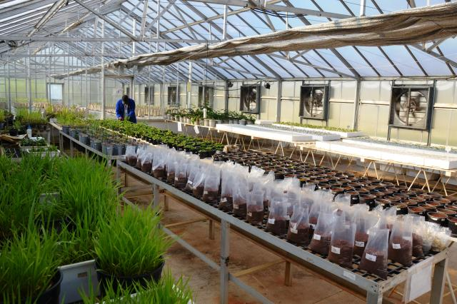
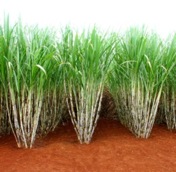
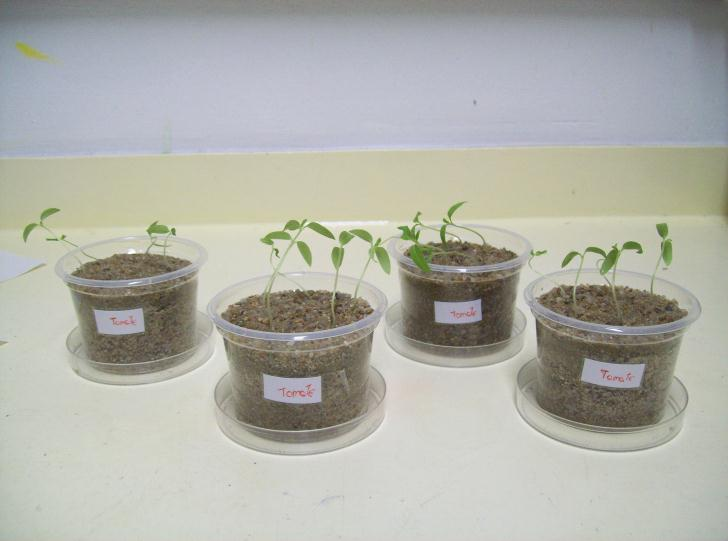

Consiste da aplicação da lógica e objetividade para compreender um fenômeno (KEMPTHORNE, 1973).

# Exemplos

## Porcos musicistas

Você gosta de ouvir Bach? Os porcos também! 

[veja aqui](https://jornal.usp.br/ciencias/ciencias-agrarias/voce-gosta-de-ouvir-bach-os-porcos-tambem/)	

	

## Casa de vegetação

	
Fonte: www.embrapa.br

## Curvas de nível

	
Fonte: Plantação de limão, Fazenda São Luiz, Fernando Prestes, SP

## Herbicida

Fonte: pergunteaoagronomo.com.br

# Definições importante 

## Planejamento

__Fase de grande importância do experimento!__

A partir do planejamento teremos orientações para 

 * instalação,

 * condução,

 * coleta de dados,

 * análise estatística. 

Um pouco de história}

experimento de Park Grass (Broadbalk) foi instalado em 1856 na Estação Experimental de Rothamsted.

Delineado para avaliar os efeitos de fertilizantes na produção de grama permanente cortada para feno. É considerado como o experimento ecológico de longo prazo mais importante do mundo.

|	Suponha que tenha sido avaliada a altura de cada uma de cinco plantas de milho, que vieram da mesma variedade e foram cultivadas sob as mesmas condições. Tem-se que o valor da altura $y_j$ será dado por:

	$$y_j = \mu + \epsilon_j,$$

em que $\mu$ corresponde à média da altura das plantas e $\epsilon_j$ corresponde à variação do acaso, ou seja, a variação devida aos fatores não controláveis.

			
Variação do Acaso

Trata-se da variação entre unidades tratadas como similares decorrentes de pequenas diferenças que não são possíveis de serem controladas.
	
	
Como medir a variação do acaso?

$$S^2 = \displaystyle{\frac{\sum_{j=1}^n(y_j-\hat{\mu})^2}{n-1}}$$		
		
				

			
Outros exemplos:}
	
*		 variações nos pesos dos animais
*		 variações de fertilidade do solo
*		 variações de espaçamento
*		 ...
	
Não se consegue eliminar a variação do acaso mas podem-se adotar estratégias que permitem a convivência com ela.
	

Objetivo do planejamento: 
Tornar mínima a variação do acaso!
Tornar possível a comparação de tratamentos diferentes
com a mínima influência possível da variação do acaso.

Estudo observacional
		
Consiste em observar fenômenos na natureza, sem submeter os indivíduos, plantas, animais, ... , a condições específicas.

$$\Downarrow$$

Planejamento de um estudo observacional

$$\Downarrow$$

Uso de técnicas de { Amostragem}
		

Planejamento de Experimentos}
	
Estudo observacional}	
		
Avaliar número de espécies, altura da árvore, DAP, ... em uma floresta nativa.
		
		

			
|		 As observações são geradas, comumente sob { condições controladas pelo pesquisador}, de tal modo que os indivíduos avaliados (plantas, animais, etc) sejam submetidos às condições específicas, denominadas { tratamentos}.
		
|		 Representa uma técnica muito importante para a aquisição do conhecimento científico.
		

Fator

|	Uma variável explanatória manipulada ou definida pelo pesquisador, que pode ser qualitativa ou quantitativa. 

Níveis de um fator

|	Os valores que um fator individual pode tomar.

Tratamentos	
		
|		São variações de um ou mais fatores de interesse no estudo.
	
	
São exemplos de tratamentos:

*		 Variedades de soja, cana-de-açúcar, café, ...
*		 Raças de gado
*		 Linhagens de frango
*		 Inseticida para controle de determinada praga
*		 Espaçamento entre linhas
*		 Doses de um determinado nutriente
*		 ...

	
Tratamento controle ou testemunha	
			
|			Caracterizado pela ausência de tratamento (controle negativo) ou por um tratamento padrão (controle positivo).
		

|	Os exemplos apresentados correspondem aos casos em que se tem apenas um FATOR de tratamento, com diferentes níveis. Entretanto, os tratamentos podem ser compostos pelas { combinações dos níveis de vários fatores}.

|  Qual tipo de armadilha captura mais insetos considerando diferentes ambientes que podem ser claros ou escuros?
	
$A_1C$ & $A_2C$ & $A_3C$
$A_1E$ & $A_2E$ & $A_3E$

	
|	 Como se comporta a produtividade média de três variedades de cana-de-açúcar considerando-se quatro doses de N?
	
$V_1D_0$ & $V_1D_1$ & $V_1D_2$ & $V_1D_3$\\
$V_2D_0$ & $V_2D_1$ & $V_2D_2$ & $V_2D_3$\\
$V_3D_0$ & $V_3D_1$ & $V_3D_2$ & $V_3D_3$\\

Variável resposta ou variável em análise	

|	Característica medida ou observada no experimento $\Rightarrow$ objetivo da pesquisa. São exemplos:

*		 peso
*		 produtividade
*		 altura
*		 DAP
*		 BRIX
*		 número de insetos mortos em amostras de $n$ insetos
*		 peso de matéria seca
*		 altura de inserção da primeira espiga (milho)
*		 ...

Unidade Observacional ou de Observação

|		Entidade física ou biológica que produzirá um único valor da variável resposta.
	
	
Unidades Experimentais ou Parcelas	
		
|	 A menor unidade que irá receber aleatoriamente um único tratamento. Pode coincidir com a unidade observacional ou corresponder a um grupo destas.
		

				
Exemplos:
	
*			 um animal
*			 um vaso com uma planta
*			 um vaso com três plantas
*			 cana-de-açúcar: cinco linhas de 10 metros
*			 5 galinhas
*			 duas mangueiras
*			...

Planejamento de Experimentos: Unidades Experimentais ou Parcelas

uma parcela no campo;

um vaso com uma planta ou três plantas, ou um grupo de vasos;

uma placa de Petri com dez sementes;
 
um paciente em um hospital (denominado sujeito);

Planejamento de Experimentos: Unidades Experimentais ou Parcelas

  

    

uma porção de massa;
um animal ou um grupo de animais;

uma execução específica em uma máquina com determinadas condições;

um lote de matéria-prima.

Observações:

|			 As parcelas em um experimento devem apresentar mesmo tamanho e mesma forma!
|			 "+" \; de um indivíduo por parcela $\Rightarrow$ < risco de perda de parcela $\Rightarrow$ trabalhar com a média observada na parcela
|			 "+" \; de um indivíduo por parcela $\Rightarrow$ medida de precisão do experimento $\Rightarrow$ Tamanho da parcela
			
Variabilidade dentro da parcela $\leq$  Variabilidade entre as parcelas

Bordadura

| 	Deve ser utilizada quando um tratamento atribuído a uma parcela pode influenciar a resposta observada na parcela vizinha. São comuns em vários experimentos:
	
*	 cana-de-açúcar
*		 fungicidas
*		 variedades que apresentam alturas diferentes $\Rightarrow$  evitar sombreamento
*		 ...

    
    
* Representação gráfica do delineamento experimental (croqui)*
* Unidade cruzadas ($\otimes$) foram ignoradas devido ao efeito da borda*
* R1-R4 indicam as quatro repetições do cultivar.

			
	
Fatores que afetam o tamanho da unidade experimental ou parcela

*		 Considerações práticas
*			 baias ou gaiolas previamente construídas;
*			 área experimental limitada;
*			 equipamento utilizado;
*			 espaço limitado em uma casa de vegetação;
*			 número de animais ou plantas disponíveis***
*			 Natureza do material experimental (relacionado ao fator anterior)
*			 área de confinamento de experimentos com gado é diferente da área de experimentos com galinha, por exemplo;
*		 o mesmo vale para experimentos de campo com diferentes culturas***
* Limitações relacionadas ao delineamento experimental;
* Custo do experimento;
* ...
	
Métodos para determinar o tamanho ótimo da parcela

|   Método da máxima curvatura}: São observadas várias parcelas pequenas de tamanho $x$. Tais parcelas são combinadas de tal modo a formar novas parcelas de vários tamanhos. As respectivas médias e variâncias são calculadas, com o objetivo de se calcularem os correspondentes coeficientes de variação. Faz-se um gráfico dos coeficientes de variação {\it versus} os respectivos tamanhos e, por inspeção, é obtido o ponto ótimo que é aquela com máxima curvatura.
		
Método da máxima curvatura
		

		
Aspectos negativos:

custo relativo o ponto de curvatura máxima não é independente do menor tamanho da parcela, $x$.
		
| Lei da variância de Fairfield Smith (também desenvolvida por Mahalanobis)}:

	$$V_x = V_1 x^{-b} \Rightarrow \log V_x = \log V_1 - b \log x,$$

| 	em que $V_x$ denota a variância da resposta por unidade de área entre parcelas de tamanho $x$; $V_1$ denota a variância entre parcelas de tamanho unitário e $b$ é o coeficiente de regressão.
|	 Tal lei pode ser relacionada com uma função custo e assim se obter o tamanho ótimo da parcela.
	
Objetivos de um experimento
	
|		 Fornecer uma comparação válida dos efeitos de tratamentos;
|		 Fornecer informações válidas a respeito do relacionamento entre as variáveis de interesse.

Exigências básicas

|		 	As condições experimentais devem representar as condições do problema de interesse.
|		 As comparações dos tratamentos devem estar livres de outras possíveis explicações devido à presença de outras variáveis ({ confundimento}).
|		 A comparação dos tratamentos deve ser feita com a menor influência de variação aleatória quanto possível.
|		 O nível de incerteza nas conclusões deve ser acessível.
|		 O experimento deve ser tão simples quanto possível.

* Resultado da colaboração entre Pesquisador e Estatístico.
*		 Deve ocorrer com um bom tempo antes da instalação do experimento.
*		 Trabalho de investigação do estatístico.
*		 Claro entendimento do problema a ser estudado. 
* Por quê o experimento será realizado?
*	 Estimação? Desejam-se estimadores não viesados e de variância mínima.
.		 Teste de hipóteses? Desejam-se testes poderosos.

Escolha do delineamento experimental	

Depende
.			 do material experimental
.			 da área experimental
.			 das condições de coleta dos dados

|		Relacionados aos { Princípios Básicos da Experimentação}, introduzidos por Fisher em 1935, são eles:
.			 Repetição
.			 Casualização
.			 Controle local

|  Justificativa: diminuir a variação não controlada e obter uma estimativa válida para tal.
		
		

Repetição
| 		Consiste da aplicação de cada tratamento a várias unidades experimentais, fornecendo assim uma medida da variação não controlada.
	

				
		
Número de repetições
	
.		 grau de precisão
.		 quantidade de variabilidade presente no material experimental
.		 fontes/material disponível
.		 tamanho e forma da parcela
	
Casualização

|		Consiste em atribuir os tratamentos às unidades experimentais de tal modo que toda unidade tem a mesma probabilidade de receber cada tratamento.

				
		

Motivos:

		 Evitar efeitos sistemáticos.
		 {\it Exemplo:} Vasos com uma variedade recebem sol da manhã e vasos de outra variedade recebem sol da tarde.
		 Evitar viés de seleção.
		 {\it Exemplo:} Parcelas com maior fertilidade recebem os melhores tratamentos.
		 Evitar viés acidental.

	
Fonte: Plantação de limão, Fazenda São Luiz, Fernando Prestes, SP

				

|  	Os princípios da repetição e da casualização devem estar presentes em todos os experimentos. Entretanto, o princípio do controle local está presente apenas em experimentos que apresentam condições heterogêneas (ambiente, material, pessoal, etc.)

	
|		Repetição + Casualização $\Rightarrow$ Delineamento Inteiramente Casualizado 
$$\Downarrow$$
Homogeneidade entre as parcelas
		
$$\left.{array}{c}
	\mbox{Repetição + }\\
	\mbox{Casualização + }\\
	\mbox{Controle Local}
	{array}\right.\Rightarrow
	\left\{{array}{c}
	\mbox{ Delineamento Casualizado em Blocos}\\
	\Downarrow\\
	\mbox{Controle local em um sentido}\\ \\
	\mbox{ Delineamento Quadrado Latino}\\
	\Downarrow\\
	\mbox{Controle local em dois sentidos}
	{array}\right.$$

$$\Downarrow$$

	Heterogeneidade entre as parcelas

$$\Downarrow$$
Subgrupos de parcelas homogêneas
	
Exemplo de um Delineamento Casualizado em Blocos

|    O vírus da batata Y (PVY) é uma séria ameaça à produção de batata devido aos efeitos no rendimento e na qualidade dos tubérculos, em particular, devido à indução de doença de mancha anelar necrótica do tubérculo da batateira (PTNRD), tipicamente associada com cepas recombinantes de PVY. Essas cepas recombinantes têm se espalhado nos Estados Unidos nos últimos anos, embora as razões para essa disseminação contínua permaneçam obscuras. Para documentar e avaliar esta propagação entre 2011 e 2015, a composição da cepa de isolados de PVY que circulam na área de produção de batata da  Columbia Basin  foi determinada a partir de centenas de lotes de sementes de vários cultivares.
|  Para abordar ainda mais a mudança na abundância de cepas, experimentos em casa de vegetação foram conduzidos (Funke et al, 2017, Plant Disease 101:20-28,
[acesse aqui](https://doi.org/10.1094/PDIS-06-16-0901-RE).
    
Exemplo de um Delineamento Casualizado em Blocos

A, Croqui do experimento em casa de vegetação, mostrando as dimensões das parcelas e o delineamento casualizado em blocos.
As letras indicam plantas de batata individuais: B = Russet Burbank, U = Umatilla Russet, R = Ranger Russet e A = Alturas.
A cor de sombreamento designa a cepa do virus de batata Y (PVY) usada para inoculação: verde significa PVY O (isolado Tb60), azul significa PVY N-Wi (isolado N1), laranja significa PVY NTN (isolado HR1) e sem sombreamento significa não inoculado.
B, Imagem da casa de vegetação antes da inoculação com isolados de PVY.

O processo experimental: fase de planejamento (BRIEN, 2019)
	
|		 Claro entendimento do problema a ser estudado e dos objetivos do experimento.
|		 Identificação das variáveis de interesse, incluindo a variável resposta (dependente), a variável explanatória (independente) e outras variáveis a serem controladas.
|		 Identificação das unidades de observação a serem utilizadas e a amostragem a ser feita para obtê-las.
|		 Identificação dos tratamentos a serem avaliados e do protocolo de aplicação dos mesmos.
|		 Alocação dos tratamentos às unidades experimentais por meio de um delineamento experimental.
|		 Identificação do processo de medida a ser utilizado.
|		 Identificação do ambiente experimental e como este será controlado.

O processo experimental: condução, coleta de dados e conclusões
	
*		 Instalação do experimento;

*		 Condução (memória);

*		 Coleta dos dados (pessoal treinado);

*		 Análise dos dados;

*	 Interpretação dos resultados (pesquisador).

	

