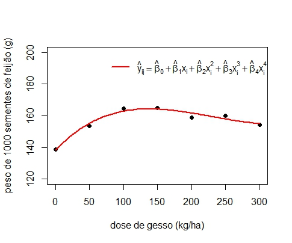

```{r, include = FALSE}
knitr::opts_chunk$set(
  collapse = TRUE,
  comment = "#>"
)
```

```{css, echo = FALSE}
body {
     text-align: justify;
}

```

# Fundamentos

|      Quando os tratamentos forem quantitativos e continuos será possivel realizar a análise dos dados a partir de uma regressão polinomial, em outras palavras estabelecer uma função para explicar o comportamento dos dados.

## Relação funcional

|     Fatores quantitativos $\Rightarrow$ Relação funcional entre a variável resposta ($y$) e os níveis desses fatores ($X$).

**Modelo**:

$$y = f(X) + \epsilon$$

em que $f(X)$ é uma função desconhecida.

**Objetivos**:

-   Obter uma função que represente $f(X)$, aproximadamente;

-   Obter o nível de $x$ que leva à máxima/mínima resposta;

-   Obter a dose econômica (é necessário conhecer a equação de lucro e o
    preço do nutriente);

### Função Polinomial de grau "p"

$$y = \beta_0 + \beta_1 X + \beta_2X^2 + \ldots + \beta_pX^p + \epsilon$$

**Características**:

-   Fácil ajuste;

-   Interpretação limitada ao intervalo de estudo;

# Exemplo

|      Ragazzi (1979) utilizou um experimento inteiramente casualizado com quatro repetições para estudar o efeito de 7 doses de gesso: 0, 50, 100, 150, 200, 250 e 300 kg/ha sobre diversas características do feijoeiro.

Tabela 1. Peso de 1000 sementes de feijão, em g, em função da dose de
gesso, em kg/ha

| Dose | I     | II    | III   | IV    |
|------|-------|-------|-------|-------|
| 0    | 134,8 | 139,7 | 147,6 | 132,3 |
| 50   | 161,7 | 157,7 | 150,3 | 144,7 |
| 100  | 160,7 | 172,7 | 163,4 | 161,3 |
| 150  | 169,8 | 168,2 | 160,7 | 161,0 |
| 200  | 165,7 | 160,0 | 158,2 | 151,0 |
| 250  | 171,8 | 157,3 | 150,4 | 160,4 |
| 300  | 154,5 | 160,4 | 148,8 | 154,0 |

Gráfico 1: Distribuição dos peso de 1000 sementes de feijão em gramas
pela dose de gesso aplicada em kg/ha


## Quadro da ANOVA

| Fonte de Variação | gl  | SQ      | QM     | F    | Ftab$_{\alpha = 0,05}$ | valor-p    |
|-------------------|-----|---------|--------|------|------------------------|------------|
| Doses             | 6   | 1941,83 | 323,64 | 7,67 | 2,57                   | 0,00018763 |
| Resíduo           | 21  | 886,34  | 42,21  |      |                        |            |
| Total             | 27  | 2828,17 |        |      |                        |            |

```{r, echo=FALSE}
library(RcmdrMisc)
local({
  .x <- seq(0.005, 10.344, length.out=1000)  
  plotDistr(.x, df(.x, df1=6, df2=21), cdf=FALSE, xlab="x", ylab="Density", main=paste("F Distribution:  Numerator df = 6, Denominator df = 21"), 
  regions=list(c(0, 2.57)), col=c('#008000', '#BEBEBE'), legend.pos='topright')
})

```

$$H_0: \text{Não há efeito de dose}$$

$$H_1: \mbox{Há efeito de dose.}$$

|      Assumindo-se o nível de 5% de significância, como F = 7,67 \> 2,57 (ou em termos das probabilidades, valor-p = 0,00018763 \< 0,05 = $\alpha$), rejeita-se $H_0$. Logo há evidências para afirmar que há efeito de Dose.

## Polinômio

Se $I$ é o número de níveis do fator quantitativo $$\Downarrow$$ Ajuste
de um polinômio de no máximo grau ($I-1$)

No exemplo: $I = 7$ doses de gesso, 0, 50, 100, 150, 200, 250 e 300.
Logo podemos ajustar um polinômio de grau no máximo 6.

### Sem efeito de dose

Gráfico 2: Linha de tendência sem efeito de dose de gesso aplicada


### Polinômio de grau 1

Gráfico 3: Linha de tendência função de primeiro grau.


$$\underbrace{\beta_0 + \beta_1X } + \underbrace{{\beta_{2}X^{2} + \beta_{3}X^{3} + \beta_{4}X^{4} + \beta_{5}X^{5} + \beta_{6}X^{6}}}$$

|              Modelo ajustado termos que podemos adicionar no modelo

| Fontes de Variação   | gl  |
|----------------------|-----|
| Doses                | 6   |
| Regressão Linear     | 1   |
| Desvios de Regressão | 5   |
| Resíduo              | 21  |
| Total                | 27  |

**Hipóteses: Desvios de Regressão**

$$H_0: \beta_2,\beta_3,\beta_4,\beta_5,\beta_6=0 | \beta_0, \beta_1 \mbox{ estão no modelo}$$

$$H_1: \beta_k\neq0 | \beta_0,\beta_1 \mbox{ estão no modelo, para algum } k=2,\ldots,6$$

**Hipóteses: Regressão Linear**

$$H_0: \beta_1=0 | \beta_0 \mbox{ está no modelo}$$

$$H_1: \beta_1\neq0 | \beta_0 \mbox{ está no modelo}$$

### Polinômio de grau 2

Gráfico 4: Linha de tendência função quadrática


$$\underbrace{\beta_0 + \beta_1X +\beta_{2}X^{2}} + \underbrace{|{\beta_{3}X^{3} + \beta_{4}X^{4} + \beta_{5}X^{5} + \beta_{6}X^{6}}}$$

|              Modelo ajustado termos que podemos adicionar no modelo

| Fontes de Variação   | gl  |
|----------------------|-----|
| Doses                | 6   |
| Termo Linear         | 1   |
| Termo Quadrático     | 1   |
| Desvios de Regressão | 4   |
| Resíduo              | 21  |
| Total                | 27  |

Hipóteses:

$$H_0: \beta_3,\beta_4,\beta_5,\beta_6=0 | \beta_0,\beta_1,\beta_2 \mbox{ estão no modelo}$$

$$H_1: \beta_k\neq0 | \beta_0,\beta_1,\beta_2 \mbox{ estão no modelo, para algum } k=3,\ldots,6$$

| Fontes de Variação   | gl  |
|----------------------|-----|
| Doses                | 6   |
| Termo Linear         | 1   |
| Termo Quadrático     | 1   |
| Desvios de Regressão | 4   |
| Resíduo              | 21  |
| Total                | 27  |

**Hipóteses: Regressão Quadrática**

$$H_0: \beta_2=0 | \beta_0,\beta_1 \mbox{ estão no modelo}$$

$$H_1: \beta_2\neq0 | \beta_0,\beta_1 \mbox{ estão no modelo}$$

Se Desvios de Regressão for não significativo $\Rightarrow$ verificar a
significância da Regressão Quadrática;

Se Desvios de Regressão for significativo $\Rightarrow$ continuar
"procurando'' pelo modelo.

### Polinômio de grau 3

Gráfico 5: Linha de tendência função cúbica


$$\underbrace{\beta_0 + \beta_1X +\beta_{2}X^{2}+\beta_{3}X^{3}} + \underbrace{|{\beta_{4}X^{4} + \beta_{5}X^{5} + \beta_{6}X^{6}}}$$

|              Modelo ajustado termos que podemos adicionar no modelo

| Fontes de Variação   | gl  |
|----------------------|-----|
| Doses                | 6   |
| Termo Linear         | 1   |
| Termo Quadrático     | 1   |
| Termo Cúbico         | 1   |
| Desvios de Regressão | 3   |
| Resíduo              | 21  |
| Total                | 27  |

**Hipóteses: Desvios de Regressão**

$$H_0: \beta_4,\beta_5,\beta_6=0 | \beta_0,\beta_1,\beta_2, \beta_3 \mbox{ estão no modelo}$$

$$H_1: \beta_k\neq0 | \beta_0,\beta_1,\beta_2,\beta_3 \mbox{ estão no modelo, para algum } k=4,5,6$$

**Hipóteses: Regressão Cúbica**

$$H_0: \beta_3=0 | \beta_0,\beta_1,\beta_2 \mbox{ estão no modelo}$$

$$H_1: \beta_3\neq0 | \beta_0,\beta_1,\beta_2 \mbox{ estão no modelo}$$

### Polinômio de grau 4

Gráfico 6: Linha de tendência para função de 4 grau



$$\underbrace{\beta_0 + \beta_1X +\beta_{2}X^{2}+\beta_{3}X^{3}+\beta_{4}X^{4}} + \underbrace{|{\beta_{5}X^{5} + \beta_{6}X^{6}}}$$

### Polinômio de grau 5

Gráfico 6: Linha de tendência para função de 5º grau


$$\underbrace{\beta_0 + \beta_1X +\beta_{2}X^{2}+\beta_{3}X^{3}+\beta_{4}X^{4}+\beta_{5}X^{5}} + \underbrace{|{\beta_{6}X^{6}}}$$

### Polinômio de grau 6

Gráfico 7: Linha de tendência para função de 6º grau


$$\underbrace{\beta_0 + \beta_1X +\beta_{2}X^{2}+\beta_{3}X^{3}+\beta_{4}X^{4}+\beta_{5}X^{5}+\beta_{6}X^{6}}$$

### Generalizando

Hipóteses:

$$
H_0: \mbox{Não há falta de ajuste no modelo}$$

$$H_1: \mbox{Há falta de ajuste no modelo}
$$

$$
H_0: \beta_1 = 0 | \beta_0 \mbox{ está no modelo}$$

$$H_1: \beta_1 \neq 0 | \beta_0 \mbox{ está no modelo} 
$$

Hipóteses:

$$
H_0: \mbox{Não há falta de ajuste no modelo}$$

$$H_1: \mbox{Há falta de ajuste no modelo}
$$

$$
H_0: \beta_2 = 0 | \beta_0, \beta_1 \mbox{ estão no modelo}$$

$$H_1: \beta_2 \neq 0 | \beta_0, \beta_1 \mbox{ estão no modelo} 
$$

Hipóteses:

$$
H_0: \mbox{Não há falta de ajuste no modelo}$$

$$H_1: \mbox{Há falta de ajuste no modelo}
$$

$$
H_0: \beta_3 = 0 | \beta_0, \beta_1, \beta_2 \mbox{ estão no modelo}$$

$$H_1: \beta_3 \neq 0 | \beta_0, \beta_1, \beta_2 \mbox{ estão no modelo}$$

| Fontes de Variação                                                                  | gl     |
|------------------------------------|------------------------------------|
| Tratamentos                                                                         | I-1    |
| Termo linear ($\beta_1|\beta_0$)                                                    | 1      |
| Termo quadrático ($\beta_2|\beta_0, \beta_1$)                                       | 1      |
| Termo cúbico ($\beta_3|\beta_0, \beta_1, \beta_2$)                                  | 1      |
| Falta de Ajuste ($\beta_4, \ldots, \beta_{I-1}|\beta_0, \beta_1, \beta_2, \beta_3$) | I-4    |
| Resíduo                                                                             | I(J-1) |
| Total                                                                               | IJ-1   |

**Observação**

|      Aumentamos, progressivamente, o grau do polinômio ajustado ($p$) até que a falta de ajuste do modelo seja não significativa e que a conclusão do teste da hipótese:

$$H_0: \beta_p = 0 | \beta_0, \beta_1, \ldots, \beta_{p-1} \mbox{ estão no modelo}$$

$$H_1: \beta_p \neq 0 | \beta_0, \beta_1, \ldots, \beta_{p-1} \mbox{ estão no modelo}$$

seja pela rejeição de $H_0$.

Dado o modelo de regressão polinomial,

$$y_{ij} = \beta_0 + \beta_1X_{i} + \beta_2X_i^2 + \beta_3X_i^3 + \ldots + \beta_{I_1}X_i^{I-1} + \epsilon_{ij},$$

tem-se que: existe dependência entre
$X_i, \; X_i^2, \; X_i^3, \; \ldots, X_i^{I-1}$, o que dificulta a
obtenção dos parâmetros
($\beta_0, \; \beta_1, \; \beta_2, \; \beta_3, \ldots, \beta_{I-1}$) e,
consequentemente, o cálculo das respectivas somas de quadrados.

|      Uma alternativa consiste em utilizar uma transformação da variável $X$, de tal modo que os novos parâmetros do modelo sejam independentes. Tal alternativa é denominada Polinômios Ortogonais.

|      Desse modo, quando se tem níveis equidistantes de tratamentos, com a variável transformada, $x_i = \frac{X_i-\bar{X}}{q}$,com $q$ sendo a distância entre dois níveis consecutivos, o modelo fica

$$y_{ij} = b_0P_{0i} + b_1P_{1i} + b_2P_{2i} + \ldots + b_{I-1}P_{(I-1)i} + \epsilon_{ij},$$

em que, $b_0, b_1, b_2, \ldots, b_{I-1}$ são parâmetros a serem
estimados, $P_{0i}, P_{1i}, P_{2i}, \ldots, P_{(I-1)i}$ são polinômios
ortogonais, desde que atendam as condições:

-   $P_{0i} = 1$,

-   $\sum_iP_{ki} = 0, \quad k=1,\ldots,{I-1}$,

-   $\sum_iP_{ki}P_{k'i} = 0$, para $k\neq k'$.

|      Coeficientes Ao utilizarmos polinômios ortogonais fazemos uso dos contrastes ortogonais. Os coeficientes para a obtenção de tais contrastas podem ser deduzidos, porém, nesta disciplinas, serão obtidos em tabelas. Por exemplo,


| Dose | Total  | Média   |     | $1^o$ | $2^o$ | $3^o$ | $4^o$ | $5^o$ |
|------|--------|---------|-----|-------|-------|-------|-------|-------|
| 0    | 554,4  | 138,600 |     | -3    | +5    | -1    | +3    | -1    |
| 50   | 614,4  | 153,600 |     | -2    | 0     | +1    | -7    | +4    |
| 100  | 658,1  | 164,525 |     | -1    | -3    | +1    | +1    | -5    |
| 150  | 659,7  | 164,925 |     | 0     | -4    | 0     | +6    | 0     |
| 200  | 634,9  | 158,725 |     | +1    | -3    | -1    | +1    | +5    |
| 250  | 639,9  | 159,975 |     | +2    | 0     | -1    | -7    | -4    |
| 300  | 617,7  | 154,425 |     | +3    | +5    | +1    | +3    | +1    |
| \-   | 4379,1 | \-      | K   | 28    | 84    | 6     | 154   | 84    |
| \-   | \-     | \-      | M   | 1     | 1     | 1/6   | 7/12  | 7/20  |

$$\underbrace{\beta_0 + \beta_1X } + \underbrace{|{\beta_{2}X^{2} + \beta_{3}X^{3} + \beta_{4}X^{4} + \beta_{5}X^{5} + \beta_{6}X^{6}}}$$

| Fontes de Variação   | gl  | SQ      | QM  | F   | Ftab | valor-p Doses |
|----------------------|-----|---------|-----|-----|------|---------------|
| Termo linear         | 1   |         |     |     |      |               |
| Desvios de Regressão | 5   |         |     |     |      |               |
| Resíduo              | 21  |         |     |     |      |               |
| Total                | 27  | 2828,17 |     |     |      |               |

$$ SQ\_{Termo ; Linear} =
\frac{\left(J\times \sum_i{a_{1i}\hat{\mu}_i}\right)^2}{J \times \sum_i a_{1i}^2}
= \frac{\left(\sum_i{a_{1i}T_i}\right)^2}{K_1\times J} =
(-3\times 554,4 -2\times 614,4 - 658,1 + 0\times 659,7
  \quad + 634,9 + 2\times 639,9 + 3\times 617,7)\^2 /
\left(28\times 4\right)  =  423,15 $$

$$SQ\_{Falta ; Aj} = SQ\_{Trat} -
SQ\_{Termo ; Linear}  =  1941,83 - 423,15  =  1518,68$$

$$QM_{Falta \; Aj} = \frac{SQ_{Falta \; Aj}}{gl_{Falta \; Aj}}
         =  \frac{1518,68}{5}
         =  303,74$$

$$F_{Falta \; Aj} = \frac{QM_{Falta \; Aj}}{QM_{Res}}
         =  \frac{303,74}{42,21}
         =  7,20$$

$$F_{Tab_{(5\%, 5,21)}} = 2,68$$

$$H_0: \beta_2, \beta_3, \ldots, \beta_6 = 0|\beta_0, \beta_1 \text{ no modelo}$$

$$H_a: \beta_k\neq 0|\beta_0, \beta_1 \text{ no modelo, para algum } k=2,\ldots,6$$

| Fontes de Variação   | gl  | SQ      | QM     | F     | Ftab | valor-p |
|----------------------|-----|---------|--------|-------|------|---------|
| Doses                | 6   | 1941,83 |        |       |      |         |
| Termo linear         | 1   | 423,15  | 423,15 | 10,03 | 4,32 | 0,00465 |
| Desvios de Regressão | 5   | 1518,68 | 303,74 | 7,20  | 2,68 | 0,00046 |
| Resíduo              | 21  | 886,34  | 42,21  |       |      |         |
| Total                | 27  | 2828,17 |        |       |      |         |

|      Como F = 7,20 \> 2,68 = Ftab (valor-p = 0,00046 \< 0,05 = $\alpha$), rejeitamos $H_0$ ao nível de 5% de significância. Logo, há evidências para afirmarmos que o modelo de regressão linear não é sufciente para explicar o comportamento do peso de 1000 semestes (em média) em função das doses de gesso.

$$\underbrace{\beta_0 + \beta_1X +\beta_{2}X^{2}} + \underbrace{|{\beta_{3}X^{3} + \beta_{4}X^{4} + \beta_{5}X^{5} + \beta_{6}X^{6}}}$$

| Fontes de Variação   | gl  | SQ      | QM  | F   | Ftab | valor-p |
|----------------------|-----|---------|-----|-----|------|---------|
| Doses                | 6   | 1941,83 |     |     |      |         |
| Termo linear         | 1   | 423,15  |     |     |      |         |
| Termo quadrático     | 1   |         |     |     |      |         |
| Desvios de Regressão | 4   |         |     |     |      |         |
| Resíduo              | 21  |         |     |     |      |         |
| Total                | 27  | 2828,1  |     |     |      |         |

$$SQ_{Termo;Quad} = \frac{(J \times \sum_i{a_{2i}\hat{\mu}_i})^2}{J \times \sum_i a_{2i}^2} = 
\frac{( \sum_i{a_{2i}T_i})^2}{J \times K_2}= (5\times 554,4 +0\times 614,4 - 3\times 658,1 -4 \times 659,7 -3\times 634,9 + 0\times 639,9 + 5\times 617,7)^2 (84\times 4)=  1285,84$$

$$SQ_{Falta \; Aj} = SQ_{Trat} - SQ_{Termo \; Linear} - SQ_{Termo \; Quad}
         =  1941,83 - 423,15 - 1285,84
         =  232,83$$

$$QM_{Falta; Aj} = \frac{SQ_{Falta; Aj}}{gl_{Falta; Aj}}
             =  \frac{232,83}{4}
             =  58,21$$

$$F_{Falta \; Aj} = \frac{QM_{Falta \; Aj}}{QM_{Res}}
             =  \frac{58,21}{42,21}
             =  1,38$$

$$F_{Tab_{(5\%, 4,21)}} = 2,84$$

$$QM_{Termo ; Quad} = \frac{SQ_{Termo \; Quad}}{gl_{Termo \; Quad}} =  \frac{1285,84}{1}
             =  1285,84$$

$$F_{Termo ; Quad} = \frac{QM_{Termo; Quad}}{QM_{Res}}
             =  \frac{1285,84}{42,21}
             =  30,47$$

$$F_{Tab_{(5\%, 1,21)}} = 4,32$$

| Fontes de Variação   | gl  | SQ      | QM      | F     | Ftab | valor-p           |
|----------------------|-----|---------|---------|-------|------|-------------------|
| Doses                | 6   | 1941,83 |         |       | 3    |                   |
| Termo linear         | 1   | 423,15  | 423,15  | 10,03 | 4,32 | 0,00465           |
| Termo quadrático     | 1   | 1285,84 | 1285,84 | 30,47 | 4,32 | 2$\times 10^{-5}$ |
| Desvios de Regressão | 4   | 232,83  | 58,21   | 1,38  | 2,84 | 0,27505           |
| Resíduo              | 21  | 886,34  | 42,21   |       |      |                   |
| Total                | 27  | 2828,17 |         |       |      |                   |

$$H_0: \beta_3,\beta_4\ldots,\beta_6 = 0| \beta_0,\beta_1,\beta_2\text{ no modelo}$$

$$H_1: \beta_k \neq 0 | \beta_0,\beta_1,\beta_2\text{ no modelo, para algum } k=3,\ldots,6$$

|      Como F = 1,38 \< 2,84 = Ftab (valor-p = 0,27505 \> 0,05 = $\alpha$), não rejeitamos $H_0$, ao nível de 5% de significância. Logo, não há evidências para afirmarmos que há falta de ajuste do modelo de regressão quadrática.

$$H_0: \beta_2 = 0| \beta_0,\beta_1\text{ no modelo}$$

$$H_1: \beta_2 \neq 0 | \beta_0,\beta_1\text{ no modelo}$$

|      Como F = 30,47 \> 4,32 = Ftab (valor-p = $2\times10^{-5} < 0,05 = \alpha$), rejeitamos $H_0$, ao nível de 5% de significância. Logo, há evidências para afirmarmos $\beta_2$ difere de zero, dado que $\beta_0$ e $\beta_1$ estão no modelo, ou seja, selecionamos o modelo de regressão quadrática para representar o comportamento do peso de 1000 sementes (em média) em função das doses de gesso.

##### Estimação dos Parâmetros

Obter $\beta_0$, $\beta_1$, $\ldots$, $\beta_p$, tais que

$$\mbox{SQ} = \sum_i\big[y_i - (\beta_0 + \beta_1X_i + \beta_2X_i^2 + \ldots + \beta_pX_i^p)\big]^2$$
seja mínima.

Ou seja,

$$.
\frac{\partial{SQ}}{\partial \beta_0} = 0   
\frac{\partial \mbox{SQ}}{\partial \beta_1} = 0  
\ldots  
\frac{\partial \mbox{SQ}}{\partial \beta_p} = 0  
\Rightarrow \hat{\beta}_0, \hat{\beta}_1, \ldots, \hat{\beta}_p $$

**Solução de Mínimos Quadrados**

Estimação dos Parâmetros

O modelo ajustado ainda pode ser dado por:

$$\hat{y}_{ij} = \bar{y} + B_1M_1P_{1i} + B_2M_2P_{2i} + \ldots + B_kM_kP_{ki},$$

em que $B$ e $M$ são obtidos na tabela,

$$B_p = \frac{\sum_{i=1}^{I}c_{pi}Ti}{K_p\times J},$$

$$P_{1i} = x, \; P_{2i} = X_i^2-\frac{I^2-1}{12}, \; P_{3i} = X_i^3-\frac{3I^2-7}{20}, ...$$

$x_i = \frac{X_i-\bar{X}}{q}$, em que $q$ é a distância entre os níveis
(devem ser equidistantes) e $I$ é o número de níveis (Pimentel-Gomes,
2000).

Modelo ajustado

$${\hat{y} = 140,7839286 + 0,2736250x - 0,0007825X^2}$$


## Coeficiente de Determinação

**Definição**

$$R^2 = \frac{\mbox{SQ Modelo}}{\mbox{SQ Tratamentos}} = 1 - \frac{\mbox{SQ Falta de Ajuste}}{\mbox{SQTratamentos}}$$

$$0\leq R^2 \leq 1$$

Proporção da variabilidade devida a tratamentos que é explicada pelo
modelo de regressão;

Quão maior o grau do polinômio, maior será o coeficiente de
determinação.

$$R^2 = \frac{\mbox{SQ Modelo}}{\mbox{SQ Tratamentos}} = \frac{\mbox{SQ TL + SQ TQ}}{\mbox{SQ Tratamentos}} = \frac{423,15 + 1285,84}{1941,83} = 0,8801.$$

|      Desse modo, aproximadamente 88% da variabilidade relacioanda aos tratamentos é explicada pelo modelo quadrático ajustado.

# Atividades

Em um experimento de adubação em eucalipto (Eucalyptus grandis)
conduzido em casa de vegetação, foram usadas 4 doses de K (0, 30, 60 e
90 ppm), obtendo-se as alturas, em cm, apresentadas no conjunto de dados
a seguir. Considerando-se que o experimento foi conduzido segundo o
delineamento inteiramente casualizado com 3 repetições, pede-se:

Tabela

Dose Altura

| Doses | Altura |     |     |
|-------|--------|-----|-----|
|       | I      | II  | III |
| 0     | 80     | 86  | 71  |
| 30    | 144    | 151 | 97  |
| 60    | 151    | 127 | 117 |
| 90    | 70     | 85  | 92  |

(a) Faça a análise descrita dos dados apresentando comentários;

(b) Encontre o modelo de regressão polinomial que melhor representa a
altura das plantas em função da dose de K aplicada. Justifique sua
escolha apresentado as hipóteses de interesse e conclusões assumindo o
nível de 5% de significância. Apresente as estimativas dos parâmetros
para tal modelo;

(c) Há uma dose que leva à máxima altura? Se sim, qual seria?

Faça o upload da resolução e tire suas
[aqui](https://forms.gle/LQ6mNE4DoR1Fk6px6)
